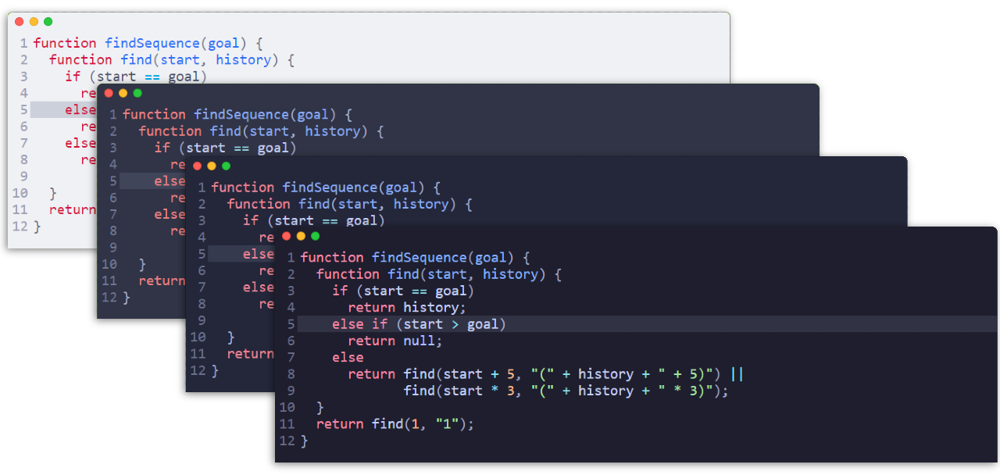
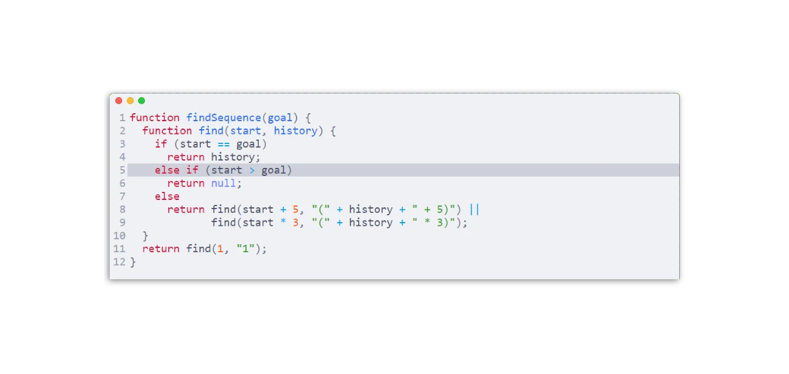
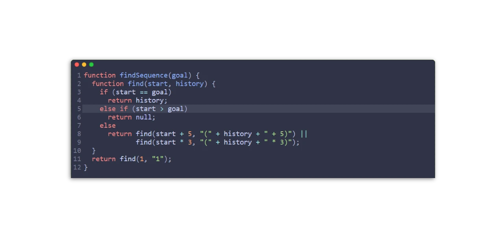
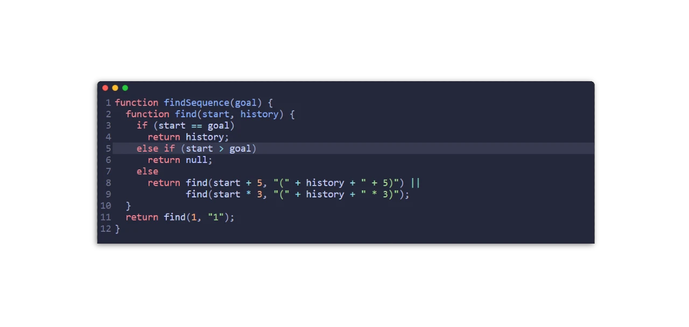
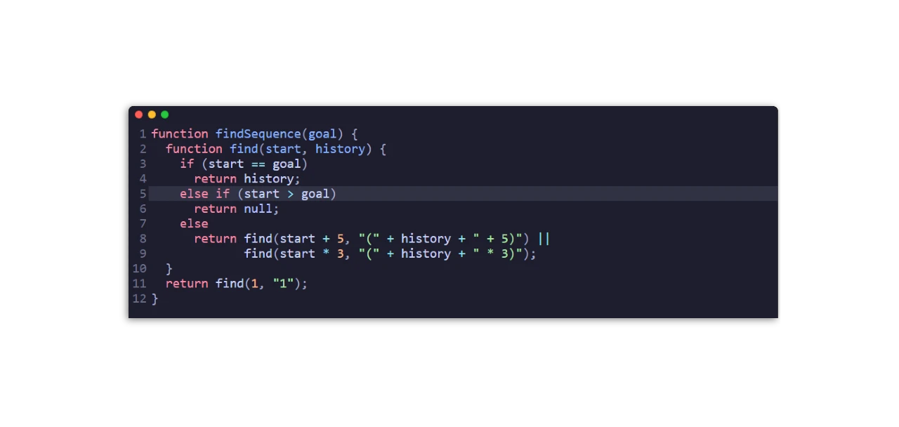

<h3 align="center">
	<br/>
	
	Catppuccin for <a href="https://codemirror.net/5/">CodeMirror</a><sup>v6</sup>
	
</h3>

<p align="center">
	<a href="https://github.com/catppuccin/codemirror/stargazers"></a>
	<a href="https://github.com/catppuccin/codemirror/issues"></a>
	<a href="https://github.com/catppuccin/codemirror/contributors"></a>
</p>

<p align="center">
	
</p>

## Previews

<details>
<summary>🌻 Latte</summary>
<a href="https://catppuccin.github.io/codemirror/#latte"></a>
</details>
<details>
<summary>🪴 Frappé</summary>
<a href="https://catppuccin.github.io/codemirror/#frappe"></a>
</details>
<details>
<summary>🌺 Macchiato</summary>
<a href="https://catppuccin.github.io/codemirror/#macchiato"></a>
</details>
<details>
<summary>🌿 Mocha</summary>
<a href="https://catppuccin.github.io/codemirror/#mocha"></a>
</details>

## Usage

```js
import { EditorView, basicSetup } from "codemirror"
import { catppuccinMocha } from "@catppuccin/codemirror"

const editor = new EditorView({
	doc: "...",
	parent: document.body
	extensions: [basicSetup, catppuccinMocha],
})
```

Check out the [demo](https://catppuccin.github.io/codemirror/) for reference.

| Palette   | Name                |
| --------- | ------------------- |
| Latte     | catppuccinLatte     |
| Frappé    | catppuccinFrappe    |
| Macchiato | catppuccinMacchiato |
| Mocha     | catppuccinMocha     |

## 🙋 FAQ

- Q: **_Is this compatible with CodeMirror5?_**\
  A: No. But you can [go back in time](https://github.com/catppuccin/codemirror/tree/aa73c1a1797c97964afcd4a3023353913ec609cb) and find what you want!

## 💝 Thanks to

**Current Maintainer(s)**

This repository currently has no maintainers.

**Past Maintainer(s)**

- [griimick](https://github.com/griimick)

**Inspiration and Contribution**

- [marijnh](https://github.com/marijnh) for [CodeMirror](https://github.com/codemirror/codemirror5)
- [ghostx31](https://github.com/ghostx31/) for [catppuccin/joplin](https://github.com/catppuccin/joplin)

&nbsp;

<p align="center">
	
</p>

<p align="center">
	Copyright &copy; 2022-present <a href="https://github.com/catppuccin" target="_blank">Catppuccin Org</a>
</p>

<p align="center">
	<a href="https://github.com/catppuccin/catppuccin/blob/main/LICENSE"></a>
</p>
