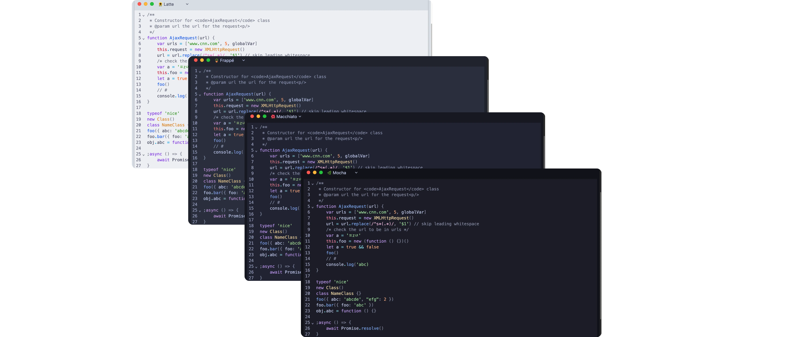
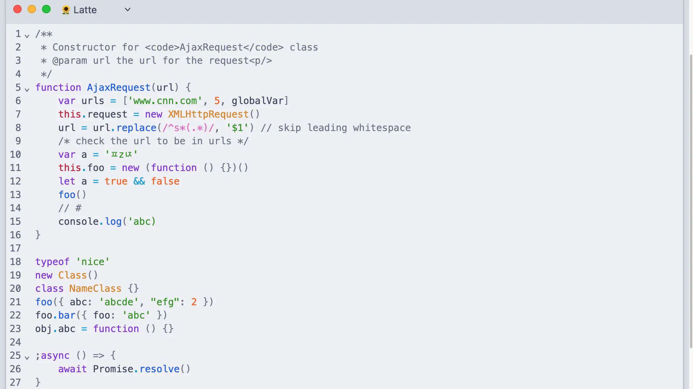
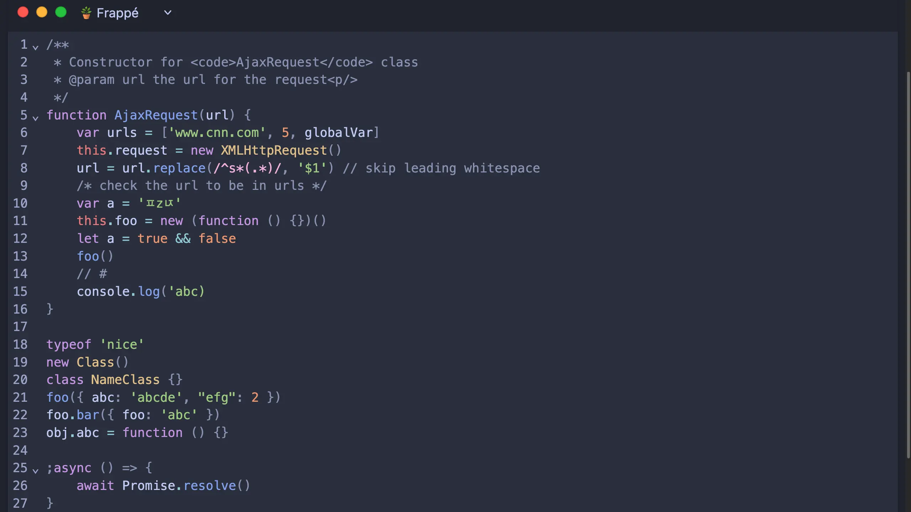
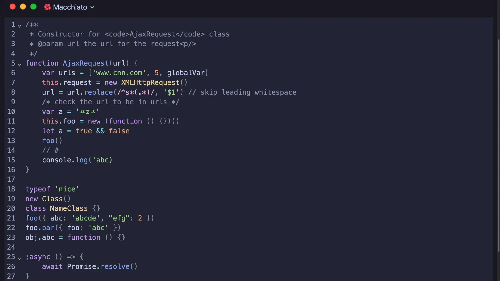
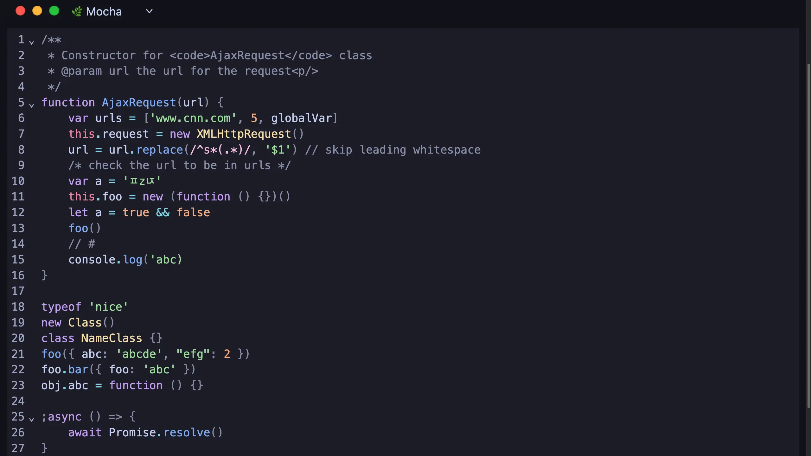

<h3 align="center">
	<br/>
	
	Catppuccin for <a href="https://codemirror.net">CodeMirror</a><sup>v6</sup>
	
</h3>

<p align="center">
	<a href="https://github.com/catppuccin/codemirror/stargazers"></a>
	<a href="https://github.com/catppuccin/codemirror/issues"></a>
	<a href="https://github.com/catppuccin/codemirror/contributors"></a>
</p>

<p align="center">
	
</p>

## Previews

<details>
<summary>🌻 Latte</summary>
<a href="https://codemirror.catppuccin.com/#latte"></a>
</details>
<details>
<summary>🪴 Frappé</summary>
<a href="https://codemirror.catppuccin.com/#frappe"></a>
</details>
<details>
<summary>🌺 Macchiato</summary>
<a href="https://codemirror.catppuccin.com/#macchiato"></a>
</details>
<details>
<summary>🌿 Mocha</summary>
<a href="https://codemirror.catppuccin.com/#mocha"></a>
</details>

## Usage

1. Install `@catppuccin/codemirror`:

   ```bash
   npm install @catppuccin/codemirror
   yarn add @catppuccin/codemirror
   pnpm add @catppuccin/codemirror
   ```

2. Import the theme in your project:

   ```js
   import { EditorView, basicSetup } from "codemirror"
   import { catppuccinLatte } from "@catppuccin/codemirror"

   const editor = new EditorView({
     doc: "...",
     parent: document.body
     extensions: [basicSetup, catppuccinLatte], // or catppuccinFrappe, catppuccinMacchiato, catppuccinMocha
   })
   ```

Check out the [demo](https://codemirror.catppuccin.com) for reference.

## 🙋 FAQ

- Q: **_Is this compatible with CodeMirror5?_**\
  A: No, see the [v0.0.1](https://github.com/catppuccin/codemirror/tree/v0.0.1) tag for CodeMirror5 support.

## 💝 Thanks to

**Current Maintainer(s)**

This repository currently has no maintainers.

**Past Maintainer(s)**

- [griimick](https://github.com/griimick)

**Inspiration and Contribution**

- [marijnh](https://github.com/marijnh) for [CodeMirror](https://github.com/codemirror/codemirror5)
- [ghostx31](https://github.com/ghostx31/) for [catppuccin/joplin](https://github.com/catppuccin/joplin)
- [BuonOmo](https://github.com/BuonOmo) for CodeMirror v6 support

&nbsp;

<p align="center">
	
</p>

<p align="center">
	Copyright &copy; 2022-present <a href="https://github.com/catppuccin" target="_blank">Catppuccin Org</a>
</p>

<p align="center">
	<a href="https://github.com/catppuccin/catppuccin/blob/main/LICENSE"></a>
</p>
